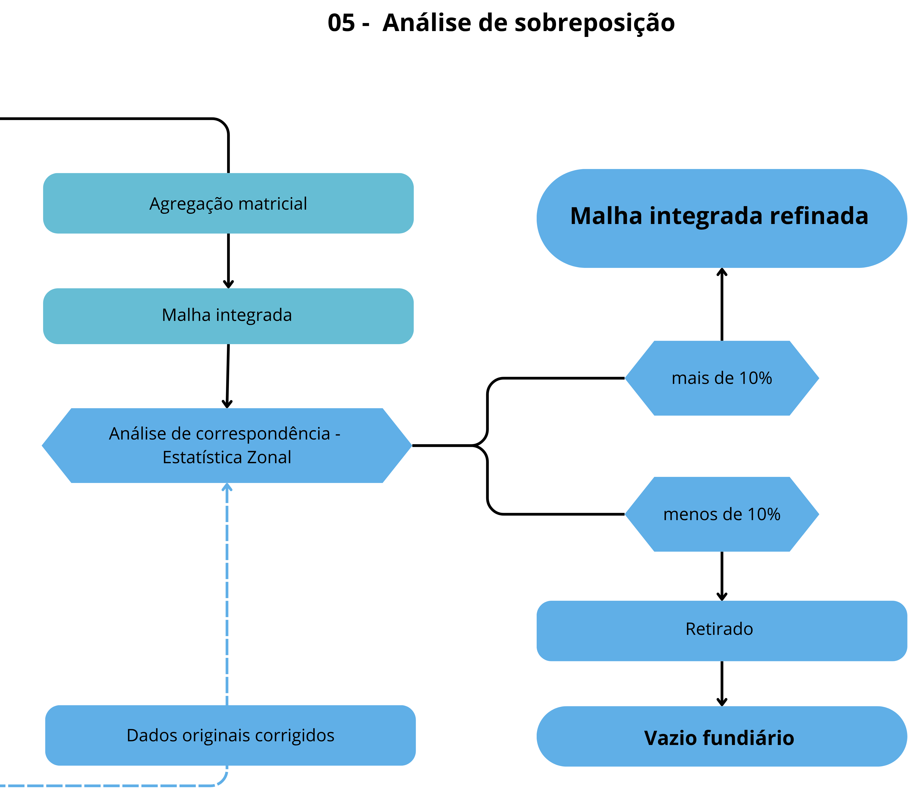

# 05. Análise de Sobreposição

Esta etapa é responsável por identificar áreas com conflito espacial — onde duas ou mais camadas fundiárias coexistem — e definir, de forma objetiva, qual classe deve prevalecer na malha final.
** **

## Como Funciona

01. **Agregação matricial:** A consolidação das camadas é realizada por meio de álgebra de mapas, aplicando-se uma operação de mínimo pixel a pixel entre todas as imagens raster. Como os valores dos pixels representam a hierarquia fundiária, o menor valor corresponde à classe de maior prioridade, sendo selecionado para compor a malha final.
02. **Geração da malha integrada:** O resultado da agregação é um único raster contínuo, no qual cada pixel representa a classe fundiária dominante, sem sobreposições ou lacunas.

** **

** **
## Refinamento Vetorial

Após a geração da malha fundiária em formato raster, cada feição vetorial original é comparada com a classe dominante na malha final.

Se mais de 10% da área da feição coincidir com a mesma classe no raster, o vetor é mantido e ajustado, sendo recortado conforme os limites definidos pela malha fundiária ambiental.

Caso contrário, a feição é descartada por não apresentar correspondência suficiente.

Na etapa final, as classes são integradas respeitando a hierarquia fundiária:

* Classes de maior prioridade são mantidas
* Classes de menor prioridade são recortadas em áreas de sobreposição

** **
## Resultados do Processo
- Áreas sem sobreposição são incorporadas diretamente.
- Áreas com sobreposição passam pela hierarquização ponderada, gerando uma malha sem vazios ou duplicidades, com decisões rastreáveis.

