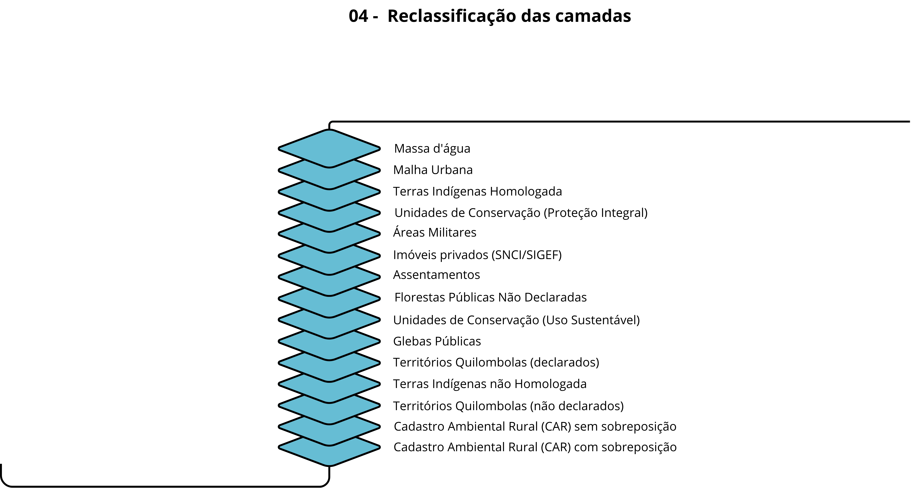

# 04. Reclassificação das Camadas

Nesta etapa, as camadas fundiárias são reclassificadas com base na hierarquização definida pelo método AHP, atribuindo a cada classe um nível de prioridade que será utilizado na resolução de conflitos espaciais. Essa etapa transforma a hierarquia conceitual (pesos AHP) em valores numéricos aplicáveis à álgebra de mapas.

## Como Funciona
01. **Cálculo do peso das camadas**: Para cada classe fundiária, são atribuídas notas para os critérios definidos (segurança jurídica, precisão geométrica, sobreposição e estabilidade), seguindo a escala de Saaty. Essas notas são ponderadas pelos pesos derivados do AHP, resultando em um peso global por classe.
02. **Definição da hierarquia**: As classes são ordenadas com base no peso global, definindo o nível de prioridade de cada uma na malha fundiária.
03. **Atribuição de valores de pixel:** Cada classe fundiária recebe um valor numérico correspondente ao seu nível hierárquico, permitindo sua diferenciação nas operações de álgebra de mapas.
04. **Geração das camadas reclassificadas:** São geradas imagens raster para cada classe fundiária, nas quais o valor do pixel representa diretamente sua prioridade hierárquica.

### Tabela 3 - Cálculo da Hierarquização das camadas fundiárias
| Classe Fundiária | Segurança Jurídica| Precisão Geométrica|Sobreposição|Estabilidade| Peso Global (AHP) | Nível Hierarquizado |
| :--- | :---: | :---: | :---: | :---: | :---: | :---: |
| Massa d'água | 9 | 9 | 9 | 9 | 9,00 | 1 |
| Malha Urbana | 9 | 9 | 9 | 9 | 9,00 | 2 |
| TI Homologada | 9 | 5 | 9 | 9 | 7,96 | 3 |
| UC Proteção Integral | 9 | 5 | 8 | 8 | 7,78 | 4 |
| Área Militar | 9 | 4 | 9 | 9 | 7,70 | 5 |
| Imóvel Privado (SIGEF/SNCI) | 7 | 9 | 7 | 7 | 7,52 | 6 |
| Assentamento | 7 | 5 | 5 | 6 | 6,18 | 7 |
| Glebas Públicas - Floresta Pública Não Destinada | 5 | 5 | 5 | 5 | 5,00 | 8 |
| UC Uso Sustentável | 5 | 5 | 4 | 5 | 4,88 | 9 |
| Glebas Públicas | 5 | 5 | 4 | 4 | 4,82 | 10 |
| Quilombola Declarado | 5 | 4 | 4 | 4 | 4,56 | 11 |
| TI Não Homologada | 4 | 4 | 3 | 4 | 3,88 | 12 |
| Quilombola Não Declarado | 4 | 4 | 3 | 4 | 3,88 | 13 |
| Imóvel Privado (CAR) sem sobreposição | 2 | 4 | 1 | 3 | 2,46 | 14 |
| Imóvel Privado (CAR) com sobreposição| 2 | 4 | 1 | 3 | 2,46 | 15 |

**Observação:** Imóvel Privado do CAR recebeu dois níveis de hierarquia (14 e 15), para distinguir o CAR sem sobreposição do CAR com sobreposição respectivamente

No final da conversão, foram gerados 14 imagens de cada camada fundiária, onde o valor do pixel é igual ao seu nivel hierarquico atribuído.

