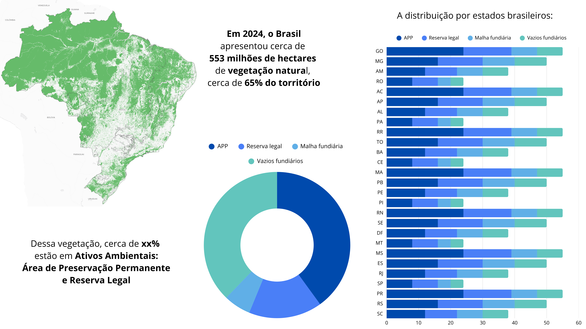
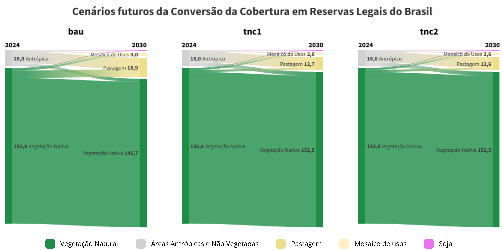

# Estatísticas

Etapa final responsável por integrar os ativos ambientais à malha fundiária consolidada, resultando em uma base única que associa estrutura territorial, uso da terra e informações ambientais, permitindo análises em escala nacional.
** **

## Ativos Ambientais no Brasil 

## Cenários futuros nas Reservas Legais

## Cenários futuros nas Áreas de Preservação Permanente

[Acessar visualização interativa](https://flourish-user-preview.com/28842321/KLxywa8SPPlfyxAQGYmCmq35ccqrFpEGHLGAR_ytH4ChlmCJzjxmDF1N4TZUaX7w/)

 
