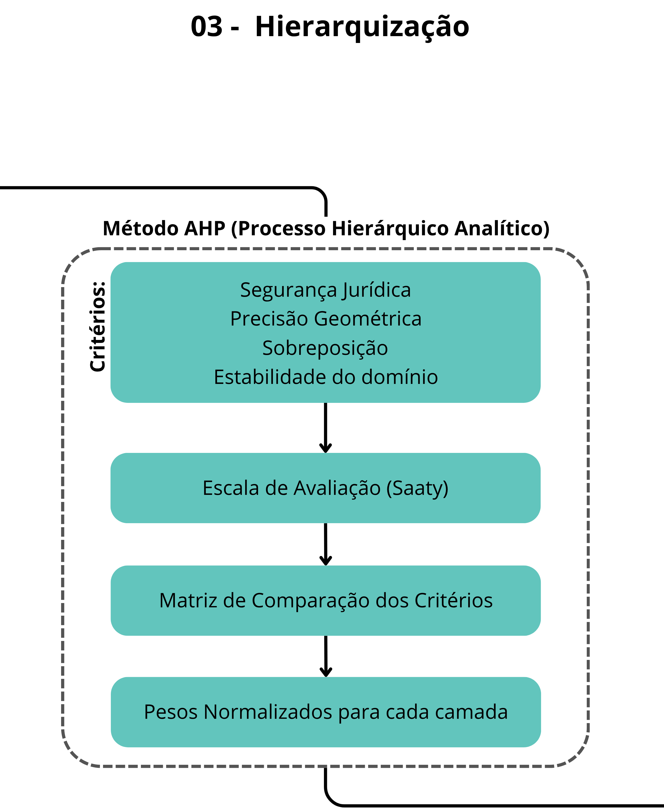

# 03. Hierarquização das camadas fundiárias

Esta etapa é responsável por identificar áreas com conflito espacial — onde dois ou mais polígonos de diferentes bases coexistem — e definir qual classe fundiária deve prevalecer na malha final.
** **

## Método AHP (Analytic Hierarchy Process)

A resolução das sobreposições é realizada por meio do método multicritério AHP (Analytic Hierarchy Process), que permite atribuir pesos relativos às diferentes camadas fundiárias com base em critérios técnicos.

Foram considerados quatro critérios principais:

1. **Segurança Jurídica:** Grau de respaldo legal e reconhecimento formal da camada
2. **Precisão Geométrica:** Qualidade e acurácia espacial dos dados
3. **Sobreposição:** Robustez da camada diante de conflitos espaciais
4. **Estabilidade do domínio:** Permanência e consolidação histórica da ocupação

## Escala de Avaliação (Saaty)
Os pesos foram definidos com base na escala de Saaty (1 a 9), utilizada para comparações pareadas:

* **Peso 1 - Importância Igual:** As duas atividades contribuem igualmente para o objetivo.
* **Peso 3 - Importância Moderada:** A experiência e o julgamento favorecem ligeiramente uma atividade sobre a outra.
* **Peso 5 - Importância Forte:** A experiência e o julgamento favorecem fortemente uma atividade sobre a outra.
* **Peso 7 - Importância Muito Forte:** Uma atividade é fortemente favorecida e sua dominância é demonstrada na prática.
* **Peso 9 - Importância Extrema:** A evidência favorecendo uma atividade sobre a outra é da ordem mais alta possível de afirmação.

## Matriz de Comparação dos Critérios

### Tabela 1: Matriz de Peso dos Critérios  
| Critérios | Segurança Jurídica | Precisão Geométrica | Sobreposição | Estabilidade | 
| :--- | :--- | :--- | --- | :--- |
| Segurança Jurídica | 1 | 3 | 5 | 7 |
| Precisão Geométrica | 1/3 | 1 | 3 | 5 |
| Sobreposição | 1/5 | 1/3 | 1 | 3 |
| Estabilidade | 1/7 | 1/5 | 1/3 | 1 |

## Pesos Normalizados para cada camada
A partir da normalização da matriz, foram obtidos os pesos finais de cada critério:

### Tabela 2: Matriz de Peso dos Critérios Normalizados 
| Critérios | Segurança Jurídica | Precisão Geométrica | Sobreposição | Estabilidade | Média (Peso) | 
| :--- | :--- | :--- | :--- | :--- | :--- |
| Segurança Jurídica | 0,599 | 0,662 | 0,536 | 0,438 | 0,56 |
| Precisão Geométrica | 0,198 | 0,221 | 0,322 | 0,313 | 0,26 |
| Sobreposição | 0,120 | 0,073 | 0,107 | 0,188 | 0,12 |
| Estabilidade | 0,084 | 0,044 | 0,035 | 0,063 | 0,06 |

## Análise de Consistência (Razão de Consistência

Para validar a matriz de comparação pareada e garantir que os julgamentos técnicos foram coerentes, aplicamos o cálculo da Razão de Consistência (RC). Segundo Saaty, um **RC < 0,10** (10%) indica que a matriz é consistente.

### 1. Cálculo do Vetor de Prioridades e Auto-vetor ($\lambda_{max}$)

O primeiro passo consiste em multiplicar a matriz original pelo vetor de pesos (médias) para obter o vetor de consistência. A soma desses valores nos fornece o auto-vetor máximo ($\lambda_{max}$).

Para esta matriz de ordem $n = 4$:

* **$\lambda_{max}$ calculado:** 4,11

### 2. Índice de Consistência (IC)

O IC mede o desvio da consistência utilizando a fórmula:

$$IC = \frac{\lambda_{max} - n}{n - 1}$$

Aplicando os valores:

$$IC = \frac{4,11 - 4}{3} = \frac{0,11}{3} = 0,0366$$

### 3. Razão de Consistência (RC)

A Razão de Consistência é obtida comparando o IC com um Índice Aleatório (IA) tabelado para matrizes de mesma ordem (Para $n=4$, $IA = 0,90$).

$$RC = \frac{IC}{IA} \Rightarrow RC = \frac{0,0366}{0,90} = 0,0407$$

[!IMPORTANT]

> **Resultado:** O valor de **RC é 4,07%**. Como este valor é inferior a 10%, a matriz de pesos é considerada **consistente** e estatisticamente válida para a hierarquização das camadas fundiárias
** **

