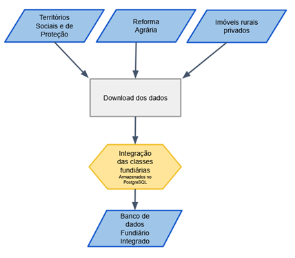

# Ingestão dos Dados 

A primeira etapa consiste na coleta e organização sistemática das bases fundiárias de referência. O objetivo é realizar o download dos dados e integrá-los em um banco de dados **PostgreSQL**, criando um ambiente unificado para o processamento.

## Bases de Dados Utilizadas

#### Grupo: Territórios Sociais e de Proteção
| Fonte | URL dos Dados |
| :--- | :--- |
| Terras Indígenas (homologadas e não homologadas)|https://geoserver.funai.gov.br/geoserver/Funai/ows?service=WFS&version=1.0.0&request=GetFeature&typeName=Funai%3Atis_poligonais&maxFeatures=10000&outputFormat=SHAPE-ZIP|
| Territórios Quilombolas (declarados e não declarados) |https://certificacao.incra.gov.br/csv_shp/export_shp.py|
| Unidades de Conservação (Uso Sustentável e Proteção Integral) |https://dados.gov.br/dados/conjuntos-dados/unidadesdeconservacao|
| Territórios de Proteção ||
| Áreas Militares |https://mapas.florestal.gov.br/portal/home/item.html?id=7d477c1d52eb41028a9f0e04036206b8|
| Massa d'águas |https://dadosabertos.ana.gov.br/datasets/4c606c38ee534b84bffe70ca6c8552c6_0/about|

#### Grupo: Reforma Agrária
| Fonte | URL dos Dados |
| :--- | :--- |
| Assentamentos |https://certificacao.incra.gov.br/csv_shp/export_shp.py|
| Glebas Públicas (SNCI Público) |https://certificacao.incra.gov.br/csv_shp/export_shp.py|
| Florestas Públicas Não Declaradas (FPND) |https://mapas.florestal.gov.br/portal/home/item.html?id=7d477c1d52eb41028a9f0e04036206b8|

#### Grupo: Imóveis Rurais Privados
| Fonte | URL dos Dados |
| :--- | :--- |
| SIGEF / SNCI (INCRA) |https://certificacao.incra.gov.br/csv_shp/export_shp.py|
| Cadastro Ambiental Rural (CAR) |https://consultapublica.car.gov.br/publico/imoveis/index|

#### Grupo: Ativos Ambientais
| Fonte | URL dos Dados |
| :--- | :--- |
| Área de preservação permanente |https://geo.fbds.org.br/|
| Reserva Legal |https://consultapublica.car.gov.br/publico/imoveis/index|

Estes dados são integrados e armazenados em um banco de dados PostgreSQL para garantir a integridade e facilitar o processamento subsequente
** **
## Fluxo de Trabalho

Figura 1 - Fluxograma de Ingestão de Dados

*Modelo de Referência: Cartas da Terra (iGPP- Cartas da Terra, 2026)*

  
  
