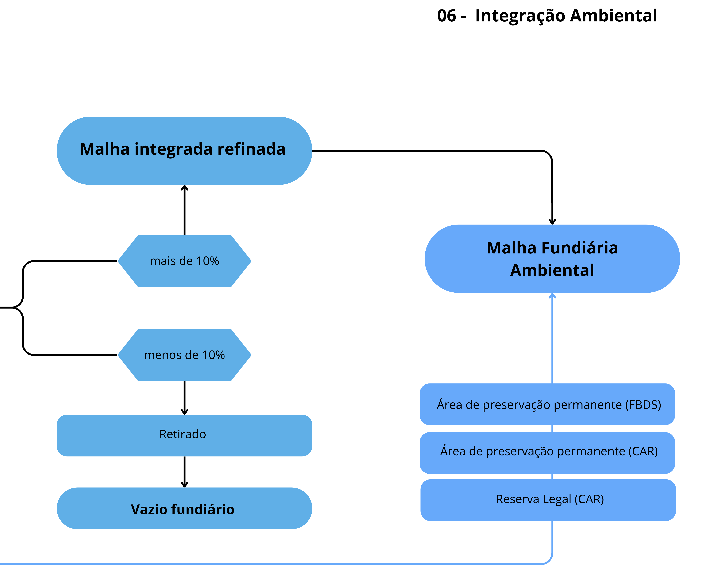
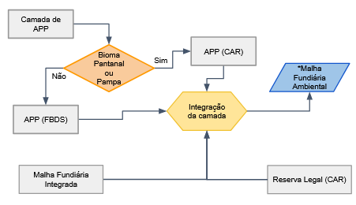

# 06. Integração Ambiental 

Etapa final responsável por integrar os ativos ambientais à malha fundiária consolidada, resultando em uma base única que associa estrutura territorial, uso da terra e informações ambientais, permitindo análises em escala nacional.
** **

## Como Funciona

01. **Incorporação de ativos ambientais:** São integradas as Áreas de Preservação Permanente (APPs), o uso e cobertura da terra e as Reservas Legais (RL) à malha fundiária.

*APPs:
** FBDS para todos os biomas, exceto Pampa e Pantanal
** CAR para Pampa e Pantanal (devido à ausência na FBDS)
*Reserva Legal:
** Extraída exclusivamente do CAR (nível de imóvel)

02. **Tratamento das APPs e RL:** APPs são agrupadas por classe de uso do solo, com remoção de polígonos residuais (slivers)
RL é agregada por código do imóvel (CAR)

03. **Eliminação de sobreposição entre ativos:** É realizada a sobreposição entre APP e RL. Em caso de interseção, a APP é mantida e o excedente da RL é removido. Isso evita dupla contagem no cálculo de ativos e passivos ambientais.

04. **Associação com a malha fundiária:** Os ativos ambientais são sobrepostos à malha fundiária. Cada ativo recebe o código da classe fundiária correspondente, permitindo identificar sua pertença territorial.

05. **Geração da malha fundiária ambiental:** Todas as camadas são integradas em uma base única, consolidando informações fundiárias e ambientais.

## Produtos Gerados

O processo resulta em três subprodutos principais:

* Malha de Classe Fundiária Final (vetorial): Estrutura vetorial consolidada (hard class)
* Malha de Classe Fundiária Final (matricial): Representação raster da malha fundiária (hard class)
* Malha de Sobreposições (matricial): Raster com a quantidade de sobreposições por pixel

 

