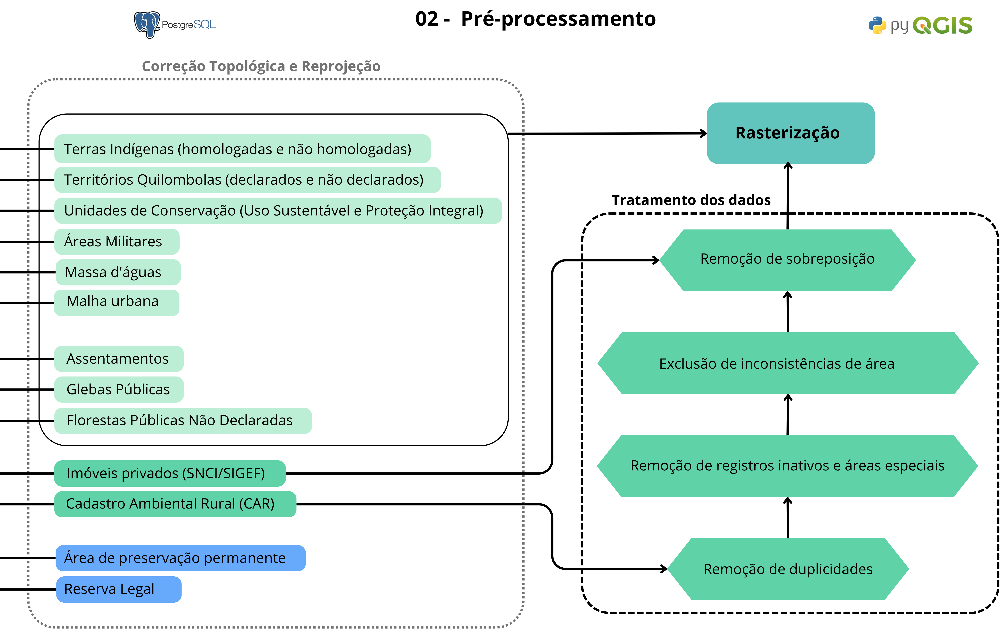
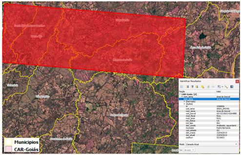

# Pré-processamento dos dados 

## Sobre
Nesta etapa, os dados brutos integrados no PostgreSQL passam por correções geométricas e filtragens rigorosas para garantir a precisão dos cálculos e a integridade da malha.

## Etapas Metodológicas
1. **Correção e Reprojeção:** Eliminação de inconsistências geométricas e reprojeção de todas as camadas para uma projeção métrica (ESRI:102033 - Albers Equal Conic).
2. **Filtragem do CAR:** Remoção de imóveis com status "Cancelado" ou "Suspenso", e exclusão de tipos de assentamentos e povos tradicionais que já existem em bases oficiais mais estáveis.
3. **Exclusão de Grilagem Digital:** Imóveis do CAR com área igual ou superior à área total do município são removidos para prevenir distorções.
4. **Resolução de Duplicidades:** Priorização do registro mais recente e eliminação de sobreposição com áreas do INCRA (SIGEF/SNCI) por meio do recorte das feições.
5. **Priorização Social:** Recorte delimitado a pequenas propriedades sobre as grande propriedades. Essa etapa é feita na base de dados do CAR e SIGEF/SNCI.

## Fluxograma 

Figura 2 - Fluxograma de Pré-processamento

## Exemplo de Grilagem Digital

Figura 3 - Exemplo de Grilagem Digital
