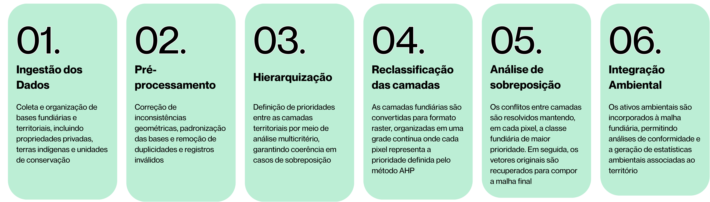
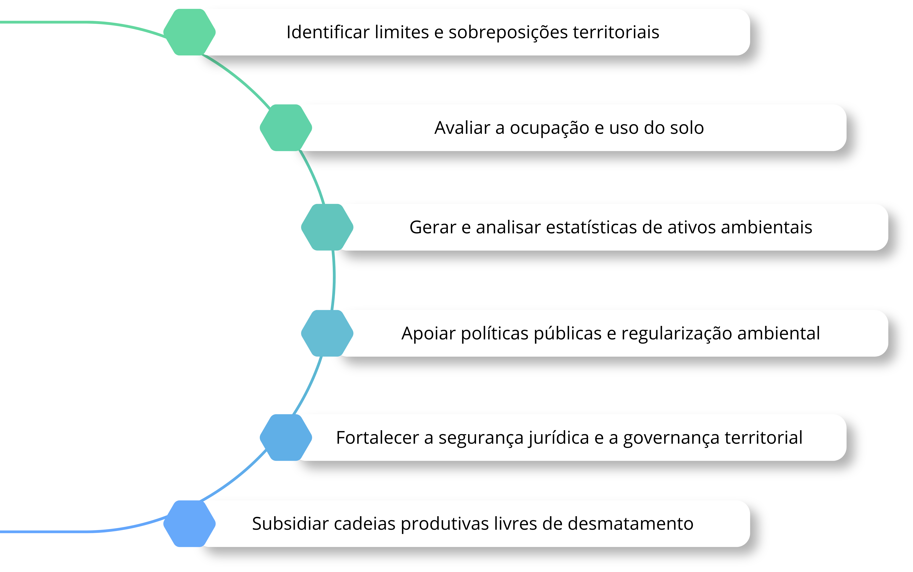

# Malha Fundiária Ambiental do Brasil: Base Integrada para Análise e Gestão Territorial 

## Sobre a Malha Fundiária Ambiental
Uma base geoespacial integrada que organiza e qualifica a estrutura fundiária e ambiental do Brasil, conectando dados territoriais para apoiar a gestão, a análise e a governança do território.

## Missão
Transformar dados territoriais em informação confiável para tomada de decisão

O Brasil possui uma grande diversidade de bases fundiárias e ambientais, muitas vezes fragmentadas, inconsistentes e sobrepostas. Essa falta de integração dificulta análises, compromete a segurança jurídica e limita a efetividade de políticas públicas. A Malha Fundiária Ambiental nasce para integrar essas informações em uma base única, padronizada e consistente e de atualização contínua, permitindo uma leitura clara da ocupação do território.

Acreditamos que a gestão territorial eficiente começa com dados confiáveis. Quando a informação é estruturada e acessível, torna-se possível identificar conflitos, avaliar ativos ambientais e apoiar decisões mais sustentáveis.

## Como é feito
Da integração de dados ao produto territorial

## O que o dado permite

## Quem desenvolve

O produto é desenvolvido pelo Laboratório de Sensoriamento Remoto e Geoprocessamento (LAPIG) da Universidade Federal de Goiás (UFG). A iniciativa reúne uma equipe multidisciplinar com atuação em sensoriamento remoto, geoprocessamento, ciência de dados, ciência ambiental e políticas públicas, dedicada ao desenvolvimento de soluções para o monitoramento e a gestão do território.

## Contato

Para parcerias, dúvidas acadêmicas ou sugestões, entre em contato pelo e-mail lapig.ufg@gmail.com

## Histórico de versões

* v 1.0
    * Construção da Malha Fundiária Ambiental Brasil. 

